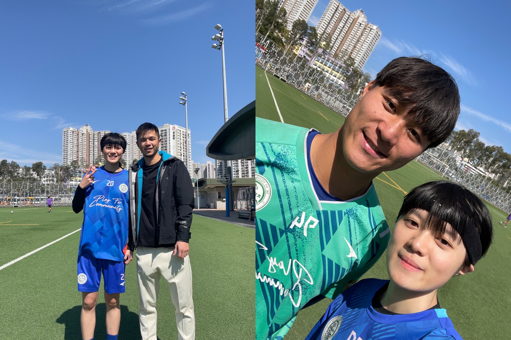

The cover was a photo shot in the Chinese New Year. The boss of our club sent out red pockets for us after training. I also got my photos with two Hong Kong national football team players in our club. And I just watched their performance in the AFC Asian Cup on TV weeks ago, where Philip Chan(left) scored the 1000th goal of the Asian Cup. Although Ka-Wing Tse(right) is the substitute goal-keeper, he is the key for the Hong Kong national U23 football team making the history in the Hangzhou Asia Games.

Looking back to my one year experience in a professional soccer club, it was really unbelievable.

## 😲 Actually New To Football
I got interested in football since I was a child, as my dad is an Arsenal fan. However, I was born in a small city and no girl played football around me.