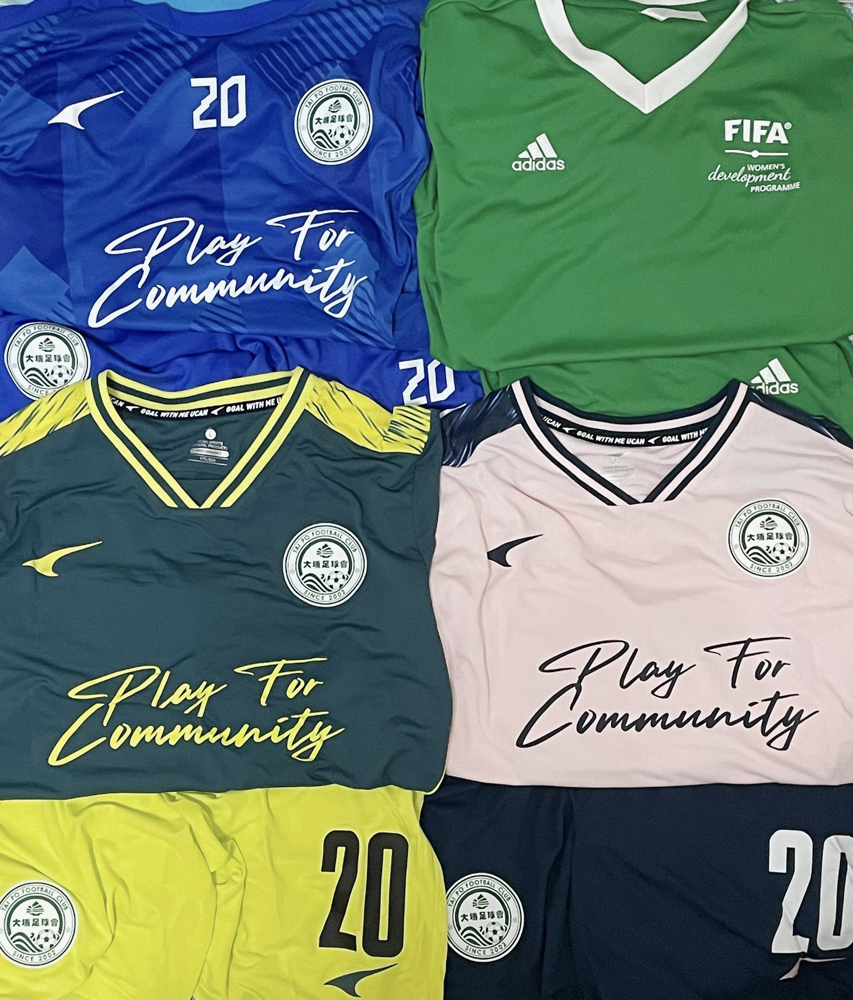

The cover was a photo shot in the Chinese New Year. The boss of our club sent out red pockets🧧 for us after training. I also got my photos with two Hong Kong national football team players in our club. And I just watched their performance in the AFC Asian Cup🏆 on TV weeks ago, where Philip Chan (left) scored the 1000th goal of the Asian Cup. Although Ka-Wing Tse (right) is the substitute goal-keeper, he is the key for the Hong Kong national U23 football team making the history in the Hangzhou Asia Games.

Looking back to my one year experience in a professional soccer club, it was really unbelievable.

## 😲 Actually New to Football
I got interested in football since I was a child, as my dad is an Arsenal fan. However, I was born in a small city and no girl played football around me. I tried to play with boys, while they either ignored me or made fun of me. Also, girls are always told to be quiet and focus on studying. I had to let go, but I still watched games sometimes.

After getting into the university (many Chinese students will finally take a breathe😂), I immediately chose the football class. But boys just asked me whether I had no choices for other PE classes. They ignored me, or stared at me when playing (as they did not want to defend me). HIT always has much more boys than girls, and I am not a social person, I stopped again🤦🏻‍♀️. But I learnt some basic passing and dribbling skills.

In year 4, I got less work to do and started working out. I saw a girl playing soccer on the pitch, and I did a brave thing (at least for me): I chatted with her. Finally I found girls playing soccer, also there were only around 8 people each time. We did not have coaches, only some kind boys taught us🙏🏻.

I would never think that I could train in a professional club one year later.

## 🎁 Gifted, Lucky or Persistent?
After getting into HKUST, I did a brave thing (at least for me) again: I private messaged the school's soccer team. Then, I trained in the HKUST women's football team. The teammates said I was gifted, and our captain asked me whether I wanted to join their soccer club. Actually I was hesitated, as I need to study and find jobs. Besides, the training pitch was really far away from HKUST (it took 3 hours by MTR). The coach of the school team also invited me to play in a team in division 2. 

Once again, I attempted to be brave😳. I decided to challenge myself. I queued for applying for the HK ID card every day. And finally, I joined TPFC after a friendly match with the EduHK soccer team🥳.

## 😢 Not That Good
I was really excited. However, the women soccer team of TPFC was created emergently. We did not have much time to train for a real match. Also I had good dribbling skills and really fast speed, the first match in division 1 really taught me a lesson: I was really easy to get tired🤯! I could only insist for 30 minutes... Actually, the fitness was the easiest thing to deal with, since I could insist 80 minutes after two weeks training in the next match. 

The biggest problem was that I was lack of experience. Soccer in school is __much more relaxed__ than real match (division 1 is actually __not professional__ though it is the highest level of the women's league). It took me long time to know my position, how to move and how to cooperate (actually I cannot say I really know now). What's more, my major is computer science, so that I need to sit for a long time in front of the laptop every day and stay up late sometimes, which is really not good for my status🙁. Sometimes some fans would watch the games, I even got yelled two times, which was really heartbreaking.

## 🥰 Grateful

--updating...